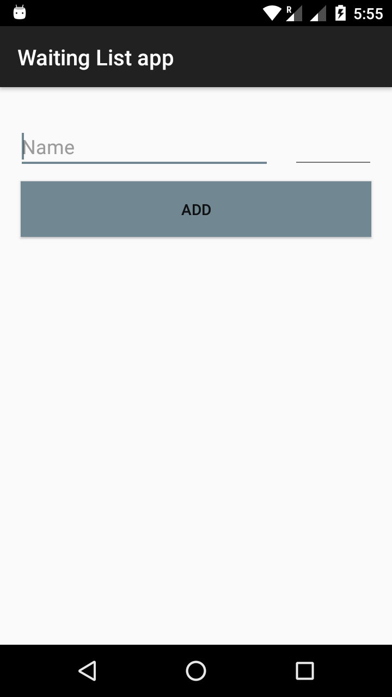
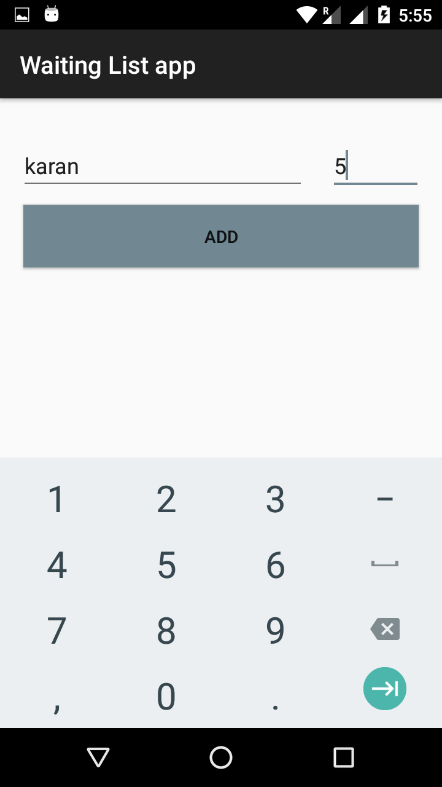
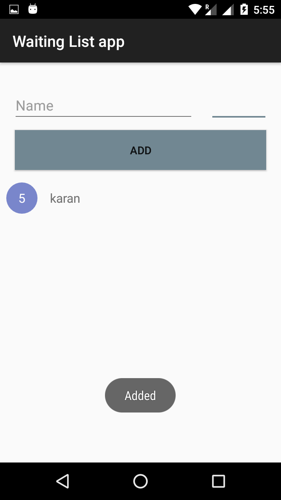
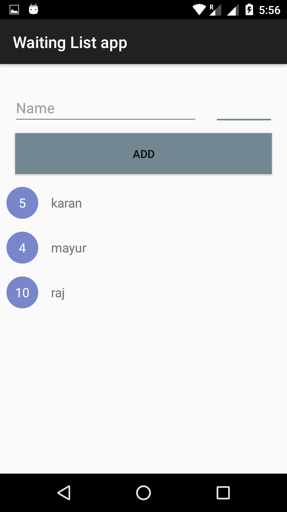

# Waiting List app database ACC

This is Waiting List app that save waiting list of guest name and number of guests at restaurants.
It also show's that how to apply validation on number TextView. Here we can not accept number guests more than 100 
this is limit in this app. **Repository pattern and Thread Pool used**.

### Note:-

Here we are using **LiveData instead of Loader**. We can use **LiveData instead of Loader**.
You can Check this documentation for Loader and LiveData [Click here](https://developer.android.com/guide/components/loaders).

### Question:-

1) Can we use **LiveData instead of Loader**? 
**Ans**:- Yes we can use **LiveData instead of Loader**.

- Database Operations use:-

 1) Insert.
 2) Delete.

- Android architecture components:-

 1) LiveData.
 2) ViewModel.
 3) Room Persistence Library.

## Screenshots:-

  

